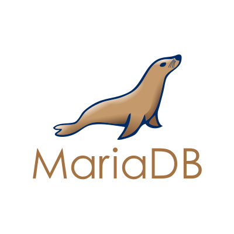

# Dockerfiles Deployment for Mediawiki and it's dependencies in Azure AKS

Package provides the dockerfile which setup and run the mediawiki & mariadb on centos VM with configuration overwrite and database setup including Azure AKS Deployment.

  

# Features

# Docker
* The docker image is built from centos:latest
* Allow user to create a database in the mariadb if the database is not created when docker container is started
* Allow user to configure the password for the 'root' account of mariadb
* Allow user to user to ssh into the container to start or stop the mariadb if needed
* Allow user to configure the mariadb such as default encoding, maximum connections, max packat allowed
* Allow user to create a mediawiki container with it's dependencies

# AKS
* The Mediawiki and MariaDB containers are deployed in AKS cluster

# Usage

## Build the mariadb docker image

Run the following command from the Dockerfiles/mariadb folder of the project to build your own mariadb docker image:

```bash
docker build -t gaja/mariadb-1.0 .
```

Run the following command from the Dockerfiles/mediawiki folder of the project to build your own mediawiki docker image:

```bash
docker build -t gaja/mediawiki-1.0 .
```

## To test locally Create and start the mariadb docker container

```bash
docker run -it --name=mariadb-1.0 -u 0  -d -p 3306:3306 mariadb-1.0:latest
```

Now you should be able to connect to the mariadb from your local computer at the port 3306, 
 
an example of the data source url will be:

<pre>
jdbc:mysql://127.0.0.1:3306/my_database?useSSL=false&useUnicode=yes&characterEncoding=UTF-8
</pre>

Note that 127.0.0.1 may need to be replaced with the ip of your docker machine VM (depends how you set up your docker machine)

## Start and stop the mariadb in the container

To start or stop the mariadb in the container, make sure that the container is running, then run the following command from your local computer:

```bash
docker exec -it <container id> /bin/bash
```

Once in the container, run the following command to start or stop the mariadb:

```bash
$ cd /home/gaja
$ sudo ./start.sh
```

```bash
$ cd /home/gaja
$ sudo ./stop.sh
```

# To test locally Create and start the Mediawiki docker container

```bash
docker run -it --name=mediawiki-1.0 -u 0 -d -p 80:80 mediawiki-1.0:latest /usr/sbin/init
```

Now you should be able to connect to the Mediawiki from your local computer at the port 180, 
 
an example of the mediawiki url will be:

<pre>
http://localhost/mediawiki
</pre>

Now all set, you can continue UI steps to complete the Mediawiki Deployment.

## Steps to deploy Mediawiki and MariaDB in Azure AKS Container

## Pre-requisites
  * Azure Account
  * Azure SDK in local
  * Storage Account Name and it's key
  * KeyVault name

Run the following command from the mediawiki folder of the project to build terraform:
```bash
terraform init
terraform plan
terraform deploy
```

Once the deployment is success, you can access mediawiki URL by it's public IP.